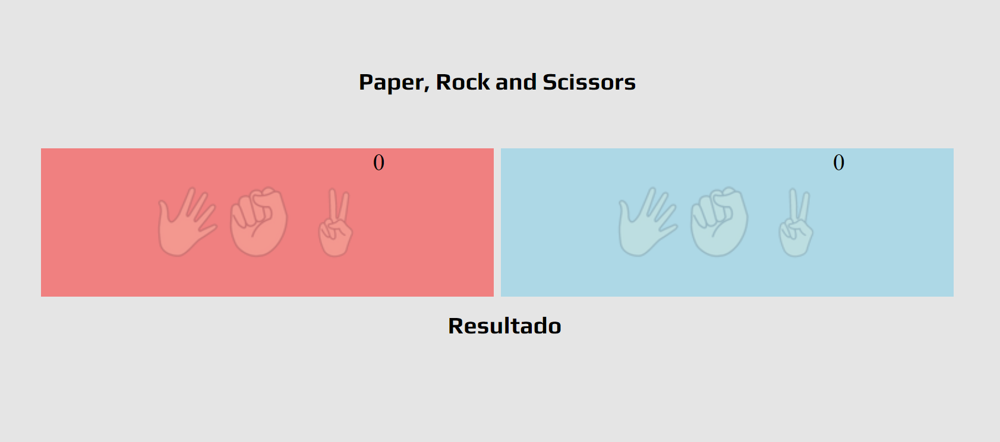

[22-03-22]

Projeto Criada para Estudar alguns principios basicos do HTML CSS e JavaScript
A ideia do projeto é criar um jogo de pedra papel e tesoura utilizando condições if e else
e operadores matematicos do javaScript.

Primeira Parte Criada 
- Estrutura Inicial Html
- Estutura Inicial Css
- Criação do Readme

[06-04-2022]

Segunda Parte Criada

- JavaScript Estruturado porem precisando refatorar
- Ajustes no CSS

Atualizações Futuras

- Colocar um input para o usuario colocar seu nome e ficar no placar
- Fazer com que mostre oque o computador selecionou

Stack Utulizada 

- HTML
- CSS
- JavaScript

Como Utilizar

- Abra o index.html em seu melhor navegador e divirta-se 